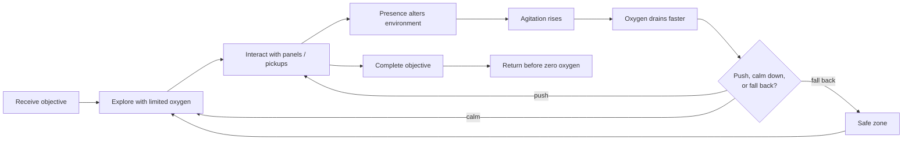
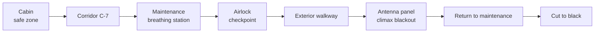
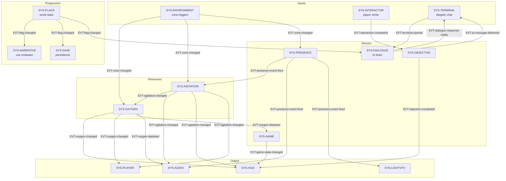
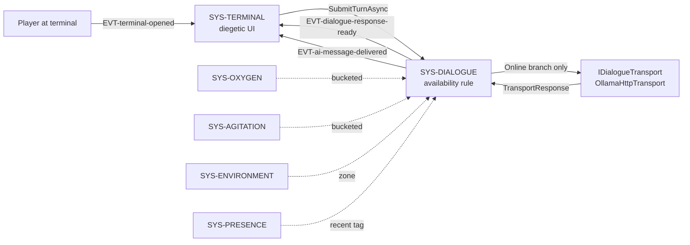
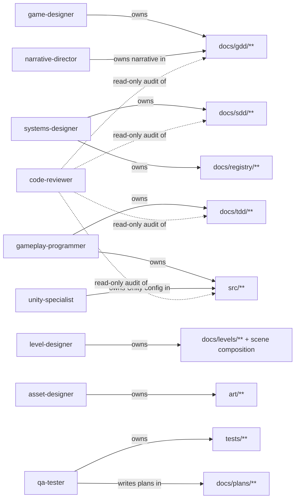
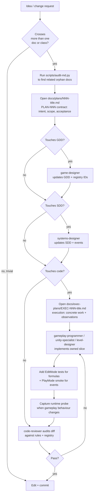
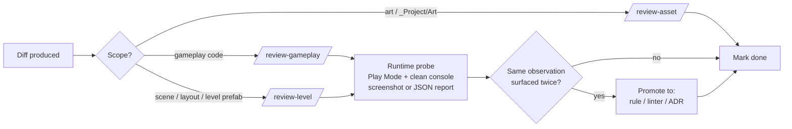
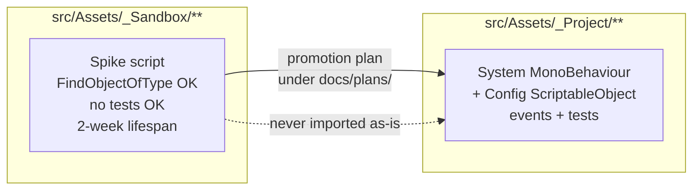

# Last Breath

A 2.5D HD adventure of exploration and psychological horror built in **Unity + URP**.
Solo-dev PoC with a 3–5 minute target playthrough.

> Cross a damaged section of a space station, retrieve an energy module, and get back before your **oxygen** runs out — while an unseen **presence** alters the world around you.

This repo is documentation-first. The Unity project under `src/` is intentionally not committed yet; everything here describes *what* the game is, *how* it gets built, and which execution artifact owns each implementation session.

---

## The game in one minute

- **Resource**: oxygen drains continuously and faster when you are agitated.
- **Threat**: a presence you never see — only knocks, flickers, voices on the radio, and doors that misbehave.
- **Verbs**: walk, sweep with the helmet flashlight, interact with panels and pickups.
- **Loop**: read the environment, decide whether to push, calm down, or fall back.
- **Win state**: insert the energy module back in maintenance and return to a safe zone.

### Core gameplay loop



### First playable scene — *Module C-7: Power Outage*



Target duration: **240 seconds**. One checkpoint, one ending.

---

## Getting started

The repo is documentation-first today. The Unity project under `src/` has not been bootstrapped yet (see [`PLAN-008`](docs/plans/008-unity-bootstrap.md)). Getting started for now means picking up the workflow itself.

On a fresh clone:

```bash
git clone <repo-url> last-breath
cd last-breath

# 1. Opt into the local pre-commit hooks (asset-design checks).
git config core.hooksPath scripts/git-hooks

# 2. Run the doc audit to see the orphan / broken-link state.
python3 scripts/audit-md.py --quiet
```

On the first Claude Code session in this clone, you will be asked to approve `.mcp.json` (project-scoped MCP servers: `context7`, `pencil`, `unity-mcp`, `blender-mcp`). Accept it. Two `SessionStart` hooks then fire automatically every session:

- `scripts/art-staging-queue.py` — surfaces pending art approvals so you can run `/art-approval-queue`.
- `scripts/check-runtime-versions.py --quiet` — drift check between `architecture.yaml::tooling` and the pinned VERSION files.

> **[`AGENTS.md`](AGENTS.md) is the source of truth.** If anything in this README disagrees with it, `AGENTS.md` wins.

The first practical action depends on what you want to do:

| If you want to… | Start with… |
|---|---|
| Understand the design | [`docs/gdd/last-breath-poc-gdd.md`](docs/gdd/last-breath-poc-gdd.md) + [`docs/registry/architecture.yaml`](docs/registry/architecture.yaml) |
| Add a new mechanic or system | `/scaffold-mechanic` or `/scaffold-system` — writes GDD/SDD/TDD stubs |
| Compose a Unity scene | Read [`docs/process/level-design.md`](docs/process/level-design.md), then `/scaffold-level` and `/level-design-session` |
| Author a 3D asset in Blender | Read [`docs/process/asset-design.md`](docs/process/asset-design.md), then `/scaffold-asset` and `/asset-design-session` |
| Implement an approved Plan | Open `docs/exec-plans/EXEC-NNN-<title>.md` from the skeleton in [`docs/process/exec-plans.md`](docs/process/exec-plans.md) |
| Review a change | `/review-gameplay`, `/review-level`, or `/review-asset` |

---

## Architecture at a glance

The PoC is a small set of MonoBehaviour systems wired by ScriptableObject configs and decoupled through typed events.



Notes on the diagram:

- `SYS-DIALOGUE` also reads `EVT-zone-changed`, `EVT-oxygen-changed`, `EVT-agitation-changed`, and `EVT-presence-event-fired` to build its prompt context. Those wires are omitted to keep the diagram readable; see `docs/registry/architecture.yaml` for the full subscription list.
- `EVT-narrative-cue-fired` (published by `SYS-NARRATIVE`) and `EVT-save-completed` / `EVT-save-restored` (published by `SYS-SAVE`) are broadcast but have no registered subscribers yet.

Canonical IDs (pillars, mechanics, systems, classes, configs, events) live in [`docs/registry/architecture.yaml`](docs/registry/architecture.yaml). Once created, an ID is never renamed — deprecated entries stay.

### Ship AI and dialogue

The terminal + dialogue stack is the project's only LLM surface. Architecture and policy live in [ADR-0006](docs/decisions/0006-transport-and-llm-policy.md) and [`PLAN-005`](docs/plans/005-ship-ai-dialogue.md).



Hard contracts:

- **One transport seam.** Only `DialogueSystem` calls `IDialogueTransport.SendAsync`, and only when `AvailabilityState == Online`. The `Garbled` and `Silent` branches synthesize responses locally without contacting the LLM.
- **Withhold by design.** The prompt context is built from an explicit allowlist: zone, bucketed oxygen and agitation, bucketed mandate / integrity / budget, capped recent exchanges, capped recent events, last significant interaction. Exact floats, full flag dictionaries, prior-session history, inbox contents, and any credential are forbidden in the prompt body.
- **No secrets in save.** `DialogueDto` carries conversational state only. Endpoints, model names, prompt templates, and tokens never enter `save.json`.

Full rule text: `GAMEPLAY-CODE-DIALOGUE-*` in [`.claude/rules/gameplay-code.md`](.claude/rules/gameplay-code.md).

---

## Repository layout

```
.
├── AGENTS.md            # Single entry-point for any agent. Read first.
├── CLAUDE.md            # Pointer back to AGENTS.md (Claude Code).
├── docs/
│   ├── gdd/             # Game design (pillars, mechanics, scenes, narrative)
│   ├── sdd/             # System architecture (responsibilities, events, invariants)
│   ├── tdd/             # Concrete classes and reference C#
│   ├── registry/        # architecture.yaml + glossary.md (canonical IDs and terms)
│   ├── plans/           # PLAN-NNN contract docs before code
│   ├── exec-plans/      # EXEC-NNN implementation records once execution starts
│   ├── levels/          # Level specs, session logs, screenshots
│   ├── specs/           # Proposed design specs awaiting implementation plans
│   ├── process/         # Cross-cutting workflows and canonical loops
│   ├── decisions/       # ADR-style decisions
│   └── engine-reference/ # Unity, Blender, and MCP version pins
├── art/                 # Blender-side staged assets before Unity import
├── .claude/
│   ├── agents/          # One file per role (designer, programmer, tester...)
│   ├── skills/          # Project workflow skills
│   └── rules/           # Hard rules layered on top of AGENTS.md
├── .mcp.json            # Project-scoped MCP server config
├── scripts/             # Tooling (e.g., audit-md.py)
└── tests/               # EditMode and PlayMode tests (created with src/)
```

Unity code will live under `src/Assets/_Project/**` (production) and `src/Assets/_Sandbox/**` (prototypes), per [`.claude/rules/gameplay-code.md`](.claude/rules/gameplay-code.md) and [`.claude/rules/prototype-code.md`](.claude/rules/prototype-code.md).

---

## Development workflow

This is a solo-dev PoC, but the workflow is designed so multiple specialized agents (Claude Code, Codex, Gemini) and a human can collaborate without stepping on each other.

### Roles and ownership



Full role table with allowed/forbidden writes is in [`AGENTS.md`](AGENTS.md#roles).

### From idea to merged change



Key invariants enforced by the workflow:

- **Plans before code** when a change touches more than one class.
- **ExecPlans for execution**: a Plan is the contract; an ExecPlan is the living implementation record once work starts.
- **Stable IDs**: `architecture.yaml` is the single source of truth — invent nothing.
- **Canonical glossary**: use `oxygen`, `agitation`, `presence`, `exterior` exactly as spelled. See [`docs/registry/glossary.md`](docs/registry/glossary.md).
- **English only** in code, identifiers, file names, comments, commit messages, docs, and chat.
- **Harness loop before done**: gameplay and level diffs go through the matching `/review-*` skill; gameplay behaviour needs a runtime-probe artifact.
- **No stale APIs**: before writing code against Unity, URP, Input System, Cinemachine, VContainer, UniTask, MCP servers, or other external APIs, query Context7 for the pinned version's docs.
- **Verify before declaring done**: a new class must compile; a new gameplay rule must have at least one test or a verifiable runtime acceptance.

### Skills and MCP servers

Most workflow surfaces are slash commands provided by skills under [`.claude/skills/`](.claude/skills/):

| Skill | Purpose |
|---|---|
| `/scaffold-mechanic` | Write GDD / SDD / TDD stubs for a new mechanic |
| `/scaffold-system` | Write GDD / SDD / TDD stubs for a new system |
| `/scaffold-level` | Write level README, `layout.yaml` skeleton, invariants test stub |
| `/scaffold-asset` | Write `art/<asset>/manifest.yaml` + recipe placeholder; appends `art_assets:` entry to the registry |
| `/asset-design-session` | End-to-end Blender authoring session via `blender-mcp` |
| `/level-design-session` | End-to-end Unity scene-composition session via `unity-mcp` |
| `/art-approval-queue` | Human-only approval flow for staged assets |
| `/verify-art-sync` | Check parity between `art/` and `src/Assets/_Project/Art/` |
| `/review-gameplay`, `/review-level`, `/review-asset` | Run `code-reviewer` against a diff in scope |
| `/unity-patterns` | Load canonical Unity patterns into context before writing C# |

MCP servers (project-scoped, committed in `.mcp.json`; versions pinned in [`docs/engine-reference/mcp/VERSIONS.md`](docs/engine-reference/mcp/VERSIONS.md)):

| Server | Use for |
|---|---|
| `context7` | Up-to-date docs for any external library before writing code (no-stale-APIs rule). |
| `pencil` | Only path to read / write `.pen` design files. |
| `unity-mcp` | Authoring surface for `level-designer` — live Unity editor. |
| `blender-mcp` | Authoring surface for `asset-designer` (full scope) and `level-designer` (read-only verbs). |

### Asset-design loop

3D assets stage under `art/<asset>/` before they ever reach Unity. Owned by `asset-designer`; rationale in [ADR-0008](docs/decisions/0008-asset-pipeline.md); canonical loop in [`docs/process/asset-design.md`](docs/process/asset-design.md).

```mermaid
flowchart LR
    S[/scaffold-asset/] --> M[art/asset/manifest.yaml<br/>approved: pending]
    M --> B[/asset-design-session/<br/>blender-mcp iterate]
    B --> SNAP[Snapshot:<br/>export .glb +<br/>screenshots]
    SNAP --> Q[/art-approval-queue/<br/>HUMAN ONLY]
    Q -->|approved: true| I[MenuItem<br/>Import Approved Assets]
    I --> U[src/Assets/_Project/Art/asset/]
    U --> L[layout.yaml can reference]
```

Three hard gates:

- **Manifest required.** Every folder under `art/` carries a `manifest.yaml` with `id`, `name`, `purpose`, `source`, `license`, `provenance`, `exports`, `screenshots`, `approved`. Empty fields fail pre-commit.
- **Approval is human-only.** Only a real user writes `approved: true` via `/art-approval-queue`. No agent and no script may flip it.
- **Import is MenuItem-only.** The single path that adds a file under `src/Assets/_Project/Art/` is the `Import Approved Assets` Editor MenuItem. Manual `cp` or drag-drop is forbidden.

Cross-tool sync between `art/` (Blender source) and `src/Assets/_Project/Art/` (Unity imports) is verified by `scripts/check-art-sync.py` — advisory on the `PostToolUse` hook, blocking on `pre-commit` when staged paths touch `art/`, `src/Assets/_Project/Art/`, or `docs/levels/**/*.layout.yaml`.

### Level-design loop

Scene composition lives at the intersection of `docs/levels/<scene>/<scene>.layout.yaml` (audit artifact) and `src/Assets/Scenes/<scene>.unity` (executable artifact). Owned by `level-designer`; rationale in [ADR-0007](docs/decisions/0007-level-design-authoring-flow.md); canonical loop in [`docs/process/level-design.md`](docs/process/level-design.md).

```mermaid
flowchart LR
    SC[/scaffold-level/] --> README[docs/levels/scene/README.md<br/>+ layout.yaml skeleton]
    README --> SESS[/level-design-session/<br/>unity-mcp iterate]
    SESS --> DUMP[DumpSpec<br/>scene to layout.yaml]
    DUMP --> VAL[ValidateScene<br/>invariants check]
    VAL --> SHOT[Screenshots +<br/>session-NNNN.md]
    SHOT --> RT[ApplySpec roundtrip<br/>idempotency test]
    RT --> COMMIT[Commit .unity +<br/>layout.yaml together]
```

Hard contracts:

- **Spec and scene ship together.** A commit that changes `.unity` also changes the matching `.layout.yaml`. They are coupled.
- **Round-trip idempotent.** `ApplySpec(DumpSpec(scene)) == scene` modulo non-load-bearing GUIDs. Enforced by the EditMode test `LevelSpec_RoundtripsScene_IsIdempotent`.
- **Approved art only.** Every art reference in a layout resolves to a file whose manifest has `approved: true` and `imported_at != null`. Pending references stay `null` with a session-log note.
- **No gameplay code in a level commit.** Cross-role plans bundle the two explicitly.

### Harness loop at session close

Every session that produced a gameplay or level diff closes the loop before the work is considered done. Methodology in [ADR-0011](docs/decisions/0011-harness-engineering-methodology.md); canonical loop in [`docs/process/harness-engineering.md`](docs/process/harness-engineering.md).



Three rules carry the loop:

- `HARNESS-LOOP-REVIEW-BEFORE-COMPLETION` — the matching `/review-*` skill runs before the change is "done" (or a skip is logged in `docs/registry/review-log.md`).
- `HARNESS-LOOP-RUNTIME-PROBE-BEFORE-COMPLETION` — a gameplay plan cites a runtime-probe artifact in its acceptance section. No artifact, not done.
- `HARNESS-LOOP-PROMOTE-RECURRING-FEEDBACK` — when the same observation surfaces twice, it is promoted to a new rule, a new linter, or a new ADR before the session closes.

### Mechanical enforcement

The agent does not have to remember most of these — tooling fires automatically:

| Surface | When | Checks |
|---|---|---|
| `SessionStart` hook | Every session | Pending art approvals (`art-staging-queue.py`); runtime-version drift (`check-runtime-versions.py`). |
| `PostToolUse` hook | After any `blender-mcp` write verb | Cross-tool sync (`check-art-sync.py`, advisory). |
| `pre-commit` hook | On `git commit` touching `art/`, `_Project/Art/`, or `*.layout.yaml` | Manifest schema, license, provenance, sync parity. Blocks the commit on failure. |
| Editor MenuItem | On art import | Hash verification, manifest updates (`imported_at`, `target_unity_guid`). |

Emergency bypass for the pre-commit hook (rare; reviewers should still catch the violation): `LASTBREATH_SKIP_ART_HOOK=1 git commit ...`.

### Production layer vs. sandbox



Rules differ by layer:

| Concern | `_Project/` | `_Sandbox/` |
|---|---|---|
| `FindObjectOfType` / `GameObject.Find` | forbidden | allowed |
| Tests for formulas / events | required | optional |
| UI mixed with logic | forbidden | allowed |
| Hardcoded constants | forbidden | allowed |
| Lifespan | indefinite | ≤ 2 weeks before promote-or-delete |

Details: [`.claude/rules/gameplay-code.md`](.claude/rules/gameplay-code.md), [`.claude/rules/prototype-code.md`](.claude/rules/prototype-code.md).

---

## Required reading before changing anything

Per [`AGENTS.md`](AGENTS.md), agents and humans should read the relevant slice of:

1. [`docs/registry/architecture.yaml`](docs/registry/architecture.yaml) — canonical IDs.
2. [`docs/gdd/last-breath-poc-gdd.md`](docs/gdd/last-breath-poc-gdd.md) — design and pillars.
3. [`docs/sdd/last-breath-poc-sdd.md`](docs/sdd/last-breath-poc-sdd.md) — system contracts.
4. [`docs/tdd/last-breath-poc-tdd.md`](docs/tdd/last-breath-poc-tdd.md) — concrete classes.
5. [`docs/engine-reference/unity/`](docs/engine-reference/unity/) — Unity version and forbidden APIs.
6. [`docs/registry/glossary.md`](docs/registry/glossary.md) — canonical terms.
7. [`docs/decisions/`](docs/decisions/) — binding ADRs.
8. [`docs/process/harness-engineering.md`](docs/process/harness-engineering.md) — review, runtime-probe, and feedback-promotion loop.
9. [`docs/process/exec-plans.md`](docs/process/exec-plans.md) — execution-document loop.

For level-design work also read [`docs/process/level-design.md`](docs/process/level-design.md), [`docs/process/unity-mcp.md`](docs/process/unity-mcp.md), and [`docs/decisions/0007-level-design-authoring-flow.md`](docs/decisions/0007-level-design-authoring-flow.md).

For asset-design work also read [`docs/process/asset-design.md`](docs/process/asset-design.md), [`docs/process/blender-mcp.md`](docs/process/blender-mcp.md), and [`docs/decisions/0008-asset-pipeline.md`](docs/decisions/0008-asset-pipeline.md).

The ADRs that bind ongoing work most directly:

| ADR | Topic |
|---|---|
| [0004](docs/decisions/0004-flag-and-narrative-event-model.md) | Flag and narrative event model (no SO event channels) |
| [0005](docs/decisions/0005-save-system-architecture.md) | Save system architecture (only `SaveSystem` touches disk) |
| [0006](docs/decisions/0006-transport-and-llm-policy.md) | LLM transport seam and prompt withhold-by-design |
| [0007](docs/decisions/0007-level-design-authoring-flow.md) | Level-design authoring flow (DumpSpec / ApplySpec / Validate) |
| [0008](docs/decisions/0008-asset-pipeline.md) | Asset pipeline (Blender → manifest → human approval → Unity) |
| [0009](docs/decisions/0009-runtime-and-tooling-versions.md) | Runtime stack — VContainer, UniTask, Addressables; version pins |
| [0011](docs/decisions/0011-harness-engineering-methodology.md) | Harness loop — review + runtime probe + promote feedback |
| [0012](docs/decisions/0012-adopt-exec-plan-methodology.md) | ExecPlans as the execution-document format |

Before drafting a new doc or plan, run the doc audit so existing material is linked or superseded rather than duplicated:

```bash
python3 scripts/audit-md.py --quiet
```

It prints `ORPHANS` (docs nothing references) and `BROKEN_REFS` (links to MDs that no longer exist).

---

## Current implementation queue

The next step toward code is still planning-led. Do **not** start with gameplay code or `PLAN-012` until its gates are done.

Priority order from [`docs/plans/README.md`](docs/plans/README.md):

1. [`PLAN-008`](docs/plans/008-unity-bootstrap.md) — create the minimum Unity project shell, package pins, asmdefs, empty `GameLifetimeScope`, and one smoke test.
2. [`PLAN-009`](docs/plans/009-levelspec-and-unity-mcp.md) — add the LevelSpec utility and `unity-mcp` authoring loop.
3. [`PLAN-010`](docs/plans/010-validate-level-design-loop.md) — validate `SCENE-CORREDOR-C7` with primitives.
4. [`PLAN-011`](docs/plans/011-asset-pipeline-wave-b.md) — validate the Unity import gate and first approved asset.
5. [`PLAN-012`](docs/plans/012-player-controls-and-camera.md) — implement player controls, billboard, side-rig camera, and DOF only after the gates above pass.

When implementation begins on any of those plans, open the first `EXEC-NNN-<title>.md` under [`docs/exec-plans/`](docs/exec-plans/) and keep it current as the living execution record.

---

## PoC scope

**In scope**: one controllable character, one linear scene, oxygen + agitation systems, helmet flashlight, 5 fixed presence events, a few interactions, one breathing station, one airlock save-point, minimal HUD, one closed ending, flag-driven save/restore at named save-points (see [`docs/plans/004-progression-and-save.md`](docs/plans/004-progression-and-save.md)), and wall-mounted terminals with an AI inbox plus a live LLM-backed chat channel (see [`docs/plans/005-ship-ai-dialogue.md`](docs/plans/005-ship-ai-dialogue.md)).

**Out of scope**: combat, scripted dialogue trees, visible enemy, chase AI, multiple endings, procedural systems, long cutscenes, multi-step puzzles.

The PoC succeeds when most playtesters complete the scene in 3–5 minutes, hesitate over the breathing station, perceive the presence as active without ever seeing it, and describe the exterior as more dangerous than the interior.

---

## License

Not yet specified.
