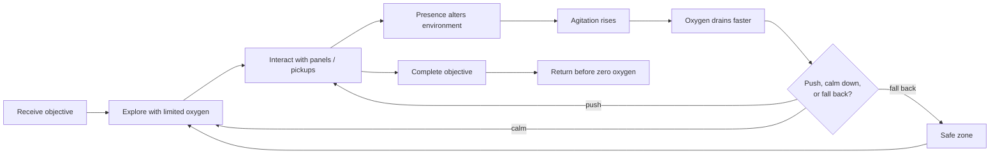
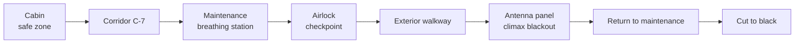
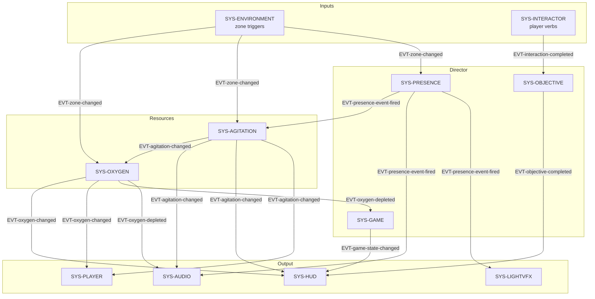
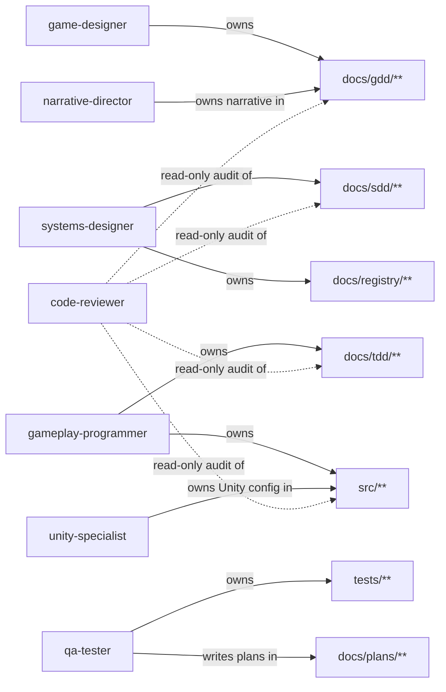
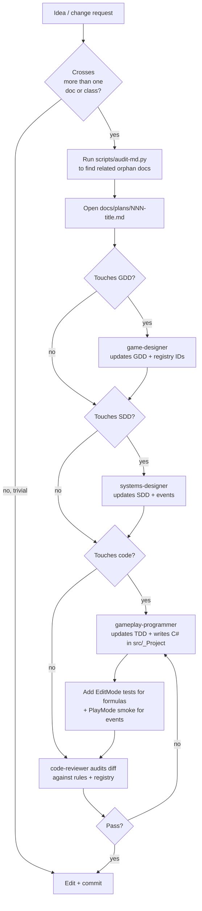
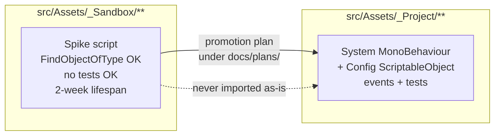

# Last Breath

A 2.5D HD adventure of exploration and psychological horror built in **Unity + URP**.
Solo-dev PoC with a 3–5 minute target playthrough.

> Cross a damaged section of a space station, retrieve an energy module, and get back before your **oxygen** runs out — while an unseen **presence** alters the world around you.

This repo is documentation-first. The Unity project under `src/` is intentionally not committed yet; everything here describes *what* the game is and *how* it gets built.

---

## The game in one minute

- **Resource**: oxygen drains continuously and faster when you are agitated.
- **Threat**: a presence you never see — only knocks, flickers, voices on the radio, and doors that misbehave.
- **Verbs**: walk, sweep with the helmet flashlight, interact with panels and pickups.
- **Loop**: read the environment, decide whether to push, calm down, or fall back.
- **Win state**: insert the energy module back in maintenance and return to a safe zone.

### Core gameplay loop



### First playable scene — *Module C-7: Power Outage*



Target duration: **240 seconds**. One checkpoint, one ending.

---

## Architecture at a glance

The PoC is a small set of MonoBehaviour systems wired by ScriptableObject configs and decoupled through typed events.



Canonical IDs (pillars, mechanics, systems, classes, configs, events) live in [`docs/registry/architecture.yaml`](docs/registry/architecture.yaml). Once created, an ID is never renamed — deprecated entries stay.

---

## Repository layout

```
.
├── AGENTS.md            # Single entry-point for any agent. Read first.
├── CLAUDE.md            # Pointer back to AGENTS.md (Claude Code).
├── docs/
│   ├── gdd/             # Game design (pillars, mechanics, scenes, narrative)
│   ├── sdd/             # System architecture (responsibilities, events, invariants)
│   ├── tdd/             # Concrete classes and reference C#
│   ├── registry/        # architecture.yaml + glossary.md (canonical IDs and terms)
│   ├── plans/           # NNN-title.md plans before code
│   ├── process/         # Cross-cutting workflows (Unity patterns, promotions)
│   ├── decisions/       # ADR-style decisions
│   └── engine-reference/unity/   # Unity version, best practices, forbidden APIs
├── .claude/
│   ├── agents/          # One file per role (designer, programmer, tester...)
│   └── rules/           # Hard rules layered on top of AGENTS.md
├── scripts/             # Tooling (e.g., audit-md.py)
└── tests/               # EditMode and PlayMode tests (created with src/)
```

Unity code will live under `src/Assets/_Project/**` (production) and `src/Assets/_Sandbox/**` (prototypes), per [`.claude/rules/gameplay-code.md`](.claude/rules/gameplay-code.md) and [`.claude/rules/prototype-code.md`](.claude/rules/prototype-code.md).

---

## Development workflow

This is a solo-dev PoC, but the workflow is designed so multiple specialized agents (Claude Code, Codex, Gemini) and a human can collaborate without stepping on each other.

### Roles and ownership



Full role table with allowed/forbidden writes is in [`AGENTS.md`](AGENTS.md#roles).

### From idea to merged change



Key invariants enforced by the workflow:

- **Plans before code** when a change touches more than one class.
- **Stable IDs**: `architecture.yaml` is the single source of truth — invent nothing.
- **Canonical glossary**: use `oxygen`, `agitation`, `presence`, `exterior` exactly as spelled. See [`docs/registry/glossary.md`](docs/registry/glossary.md).
- **English only** in code, identifiers, file names, comments, commit messages, docs, and chat.
- **Verify before declaring done**: a new class must compile; a new gameplay rule must have at least one test or a verifiable acceptance.

### Production layer vs. sandbox



Rules differ by layer:

| Concern | `_Project/` | `_Sandbox/` |
|---|---|---|
| `FindObjectOfType` / `GameObject.Find` | forbidden | allowed |
| Tests for formulas / events | required | optional |
| UI mixed with logic | forbidden | allowed |
| Hardcoded constants | forbidden | allowed |
| Lifespan | indefinite | ≤ 2 weeks before promote-or-delete |

Details: [`.claude/rules/gameplay-code.md`](.claude/rules/gameplay-code.md), [`.claude/rules/prototype-code.md`](.claude/rules/prototype-code.md).

---

## Required reading before changing anything

Per [`AGENTS.md`](AGENTS.md), agents and humans should read the relevant slice of:

1. [`docs/registry/architecture.yaml`](docs/registry/architecture.yaml) — canonical IDs.
2. [`docs/gdd/last-breath-poc-gdd.md`](docs/gdd/last-breath-poc-gdd.md) — design and pillars.
3. [`docs/sdd/last-breath-poc-sdd.md`](docs/sdd/last-breath-poc-sdd.md) — system contracts.
4. [`docs/tdd/last-breath-poc-tdd.md`](docs/tdd/last-breath-poc-tdd.md) — concrete classes.
5. [`docs/engine-reference/unity/`](docs/engine-reference/unity/) — version and forbidden APIs.
6. [`docs/registry/glossary.md`](docs/registry/glossary.md) — canonical terms.

Before drafting a new doc or plan, run the doc audit so existing material is linked or superseded rather than duplicated:

```bash
python3 scripts/audit-md.py --quiet
```

It prints `ORPHANS` (docs nothing references) and `BROKEN_REFS` (links to MDs that no longer exist).

---

## PoC scope

**In scope**: one controllable character, one linear scene, oxygen + agitation systems, helmet flashlight, 5 fixed presence events, a few interactions, one breathing station, one airlock checkpoint, minimal HUD, one closed ending.

**Out of scope**: combat, dialogue trees, visible enemy, chase AI, multiple endings, save/load, procedural systems, long cutscenes, multi-step puzzles.

The PoC succeeds when most playtesters complete the scene in 3–5 minutes, hesitate over the breathing station, perceive the presence as active without ever seeing it, and describe the exterior as more dangerous than the interior.

---

## License

Not yet specified.
